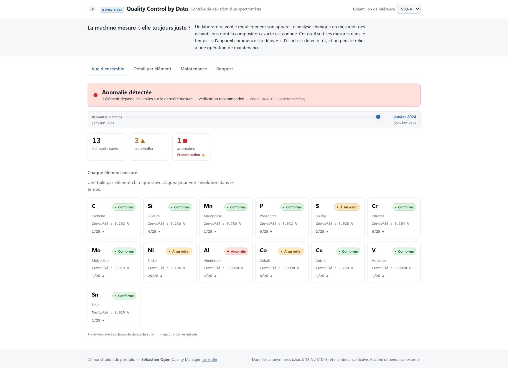
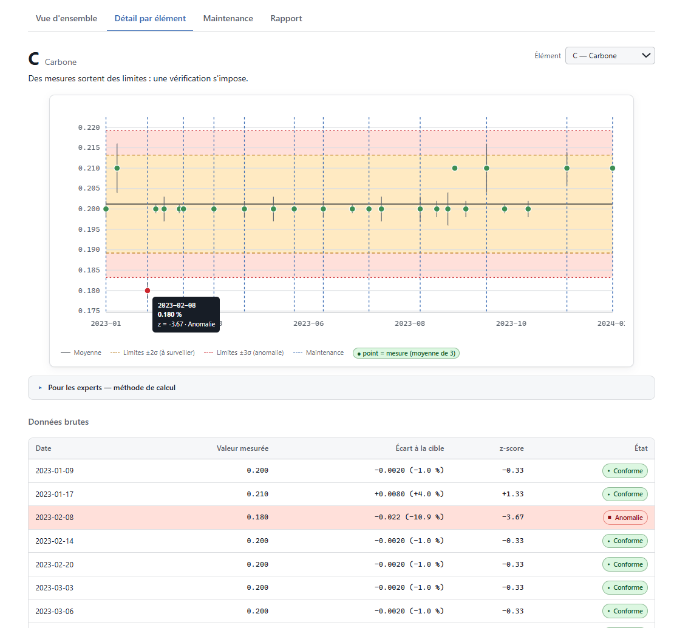
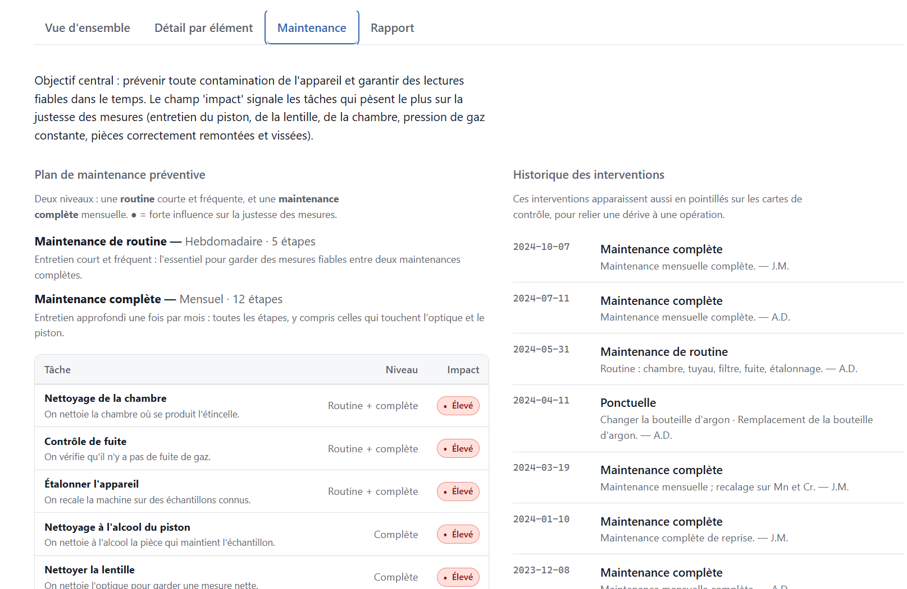
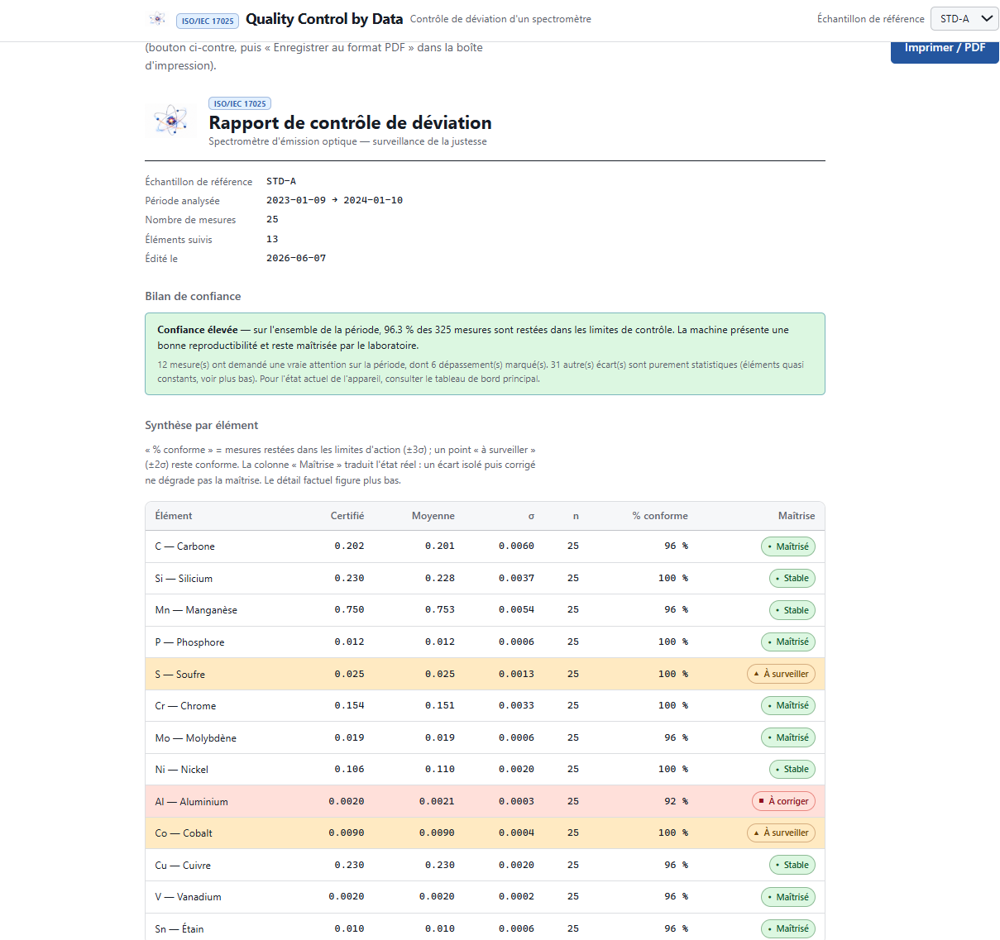

# Quality Control by Data — Contrôle de déviation d'un spectromètre

> **La machine d'analyse mesure-t-elle toujours juste ?**
> Une application web qui surveille, dans le temps, la justesse d'un spectromètre
> d'émission optique de laboratoire, et relie ses dérives aux opérations de maintenance.

🔗 **Démo en ligne** : [quality-control-by-data.netlify.app](https://quality-control-by-data.netlify.app/)

---

## Aperçu

| Vue d'ensemble | Détail par élément |
|:---:|:---:|
|  |  |

| Plan de maintenance | Rapport de contrôle |
|:---:|:---:|
|  |  |

---

## Le problème, en une phrase

Un laboratoire accrédité (ISO/IEC 17025) doit prouver que son appareil d'analyse
chimique reste fiable. Pour cela, il mesure régulièrement des **échantillons de
référence** dont la composition exacte est connue. Si l'appareil commence à
« dériver », il faut le détecter tôt, comprendre pourquoi, et corriger.

Cet outil reproduit, en web statique, un instrument Excel/VBA d'entreprise qui
faisait exactement cela — rendu lisible pour un non-expert, tout en restant
rigoureux pour un métrologue.

## Ce que montre l'application

- **Vue d'ensemble** : la machine est-elle sous contrôle ? Combien d'éléments à
  surveiller, combien en anomalie ? Une tuile par élément chimique.
- **Détail par élément** : une **carte de contrôle** dans le temps (mesures,
  moyenne, limites ±2σ et ±3σ), avec les interventions de maintenance superposées
  pour corréler dérive et entretien. Tableau de données traçable dessous.
- **Maintenance** : un plan préventif à deux niveaux (routine hebdomadaire /
  maintenance complète mensuelle) et l'historique des interventions.

Chaque écran suit le principe **double niveau** : réponse en langage simple en
façade, détail technique (z-score, σ, formules) accessible d'un clic.

## La méthode de calcul (pour les curieux)

Pour chaque mesure d'un élément :

```
z-score = (valeur mesurée − valeur certifiée) / σ_historique
limites = moyenne ± 2σ (à surveiller)  et  ± 3σ (anomalie)
```

- `σ_historique` et la moyenne sont **recalculés sur l'historique réel** à chaque
  ajout (pas de valeur théorique figée).
- Statuts : `|z| < 2` conforme · `2 ≤ |z| < 3` à surveiller · `|z| ≥ 3` anomalie.

L'algorithme a été extrait du VBA d'origine puis **vérifié sur les valeurs réelles**
(voir [`docs/source-analysis.md`](docs/source-analysis.md)).

## Stack technique

- **HTML / CSS / JavaScript vanilla**, zéro dépendance npm en production.
- **Graphiques en SVG natif** (aucune librairie de charting).
- Moteur de calcul **pur et testé**, séparé du DOM.
- Accessibilité **WCAG AA** : onglets ARIA, navigation clavier, couleur jamais
  seule pour un statut, `prefers-reduced-motion`.
- Déploiement **Netlify** statique, sans backend.

## Lancer en local

L'app charge des fichiers JSON par `fetch` : il faut un serveur HTTP (pas
d'ouverture directe du fichier).

```bash
python -m http.server 8000
# puis ouvrir http://localhost:8000
```

## Données

Les **identifiants réels** des échantillons de référence sont **anonymisés**
(`STD-A`, `STD-B`). Le **plan de maintenance est fictif** (le fichier source
d'entreprise était confidentiel). Les fichiers sources (`.xlsm`, `.pdf`) ne sont
**jamais** versionnés (voir `.gitignore`).

Régénérer les données depuis les sources (non publiques) :

```bash
python scripts/extract.py
```

## Tests

```bash
node test/engine.test.mjs        # 39/39
node test/compliance.test.mjs    # 27/27
```

## Structure

```
├── index.html
├── src/            engine.js · compliance.js · app.js · style.css
├── data/           crm_data.json (anonymisé) · maintenance.json (fictif)
├── scripts/        extract.py (Excel → JSON, idempotent)
├── test/           engine.test.mjs · compliance.test.mjs
└── docs/           source-analysis.md
```

---

**Auteur** : Sébastien Oger — Quality Manager.
Projet de portfolio : transformer un outil métier Excel/VBA en application web
testée, accessible et déployée.
